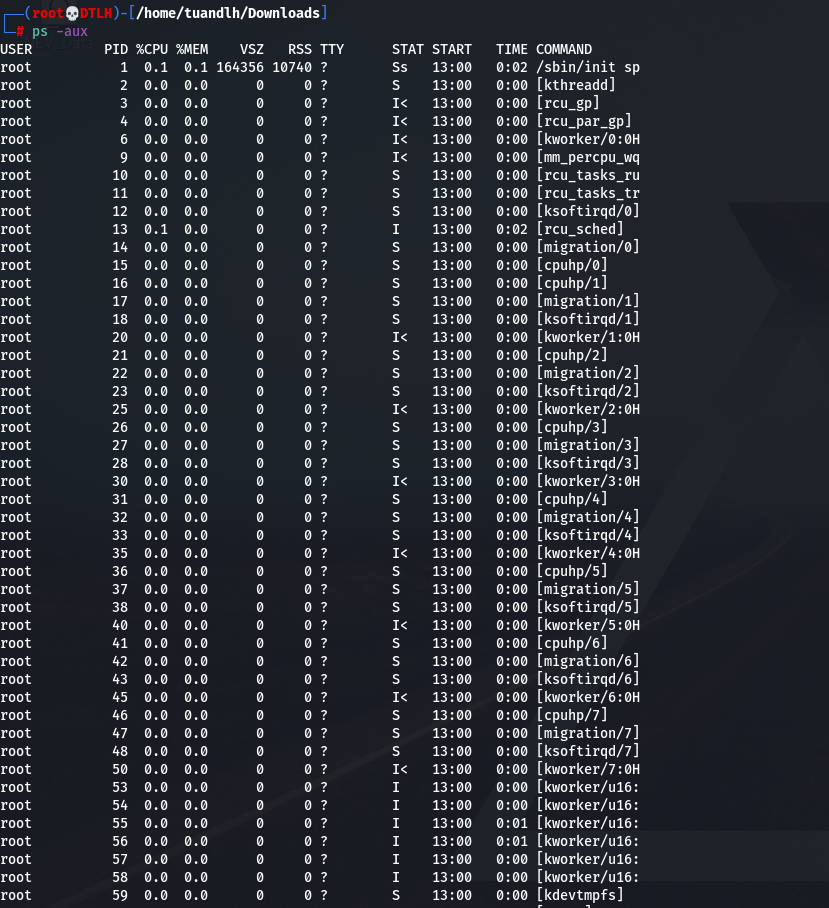
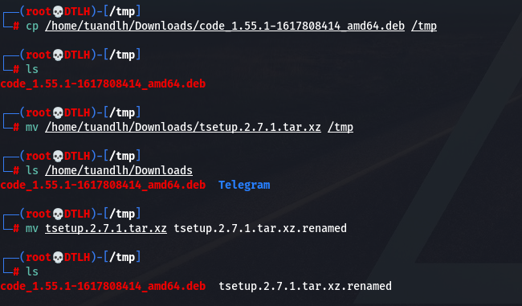

# Report_Vietnix_LinuxBasic

## BASE COMMAND
`man <name_of_tool>` to see explain for tool and using Google Search to get more detail.

## 1. Check diskspaces
Code:
```
df -a
```
Result:


## 2. Check partitions
Code:
```
fdisk -l
```
Result:


## 3. Check cpu, ram, network
### 3.1 Check system realtime
Code:
```
top
```
Result:

Explain:

\- We can see system report at realtime monitoring with:
* `load average` as CPU GHz
*  `%Cpu(s) 3.4 us, 0.8 sy` as % CPU used for user and system
* `MidB Mem: ` as Memory used

### 3.2 Check network
Code:
```
netstat && netstat -s
```
Result 01:


Result 02:


# 4. Process Monitor
Code:
```
ps -aux
```
Result:


# OR

Code:
```
htop # as a full monitor tool.
```
Result:


Explain:
- We can use `htop` to see CPU stat, Mem stat and many process which is running in system. `htop` is a realtime tool.

# 5. List files/ directories
Code:
```
ls && ls -la
```
Result:

Explain: `ls` is command to show files/directories which have in dir, `ls -la` can also see `chmod` status of files/ folders inside.

# 6. Find, Copy, Move, Rename
## 6.1 Find
Code:
```
locate <str_to_find> # or using whereis for find src of tool
```
Result:


## 6.2 Copy, Move, Rename

Code:
```
cp <src file> <des file>
mv <src file> <des locate> # For move
mv <old name> <new name> # For rename
```
Result:



# 7. System Decentralization 

Code:
```
chmod a+x <file name>
chown <new user> <file to change owner>
chgrp <new gr> <file to change group owner>
```
Result:


Explain: 
* There are 3 types of rule with `r-read`, `w-write`, `x-excute` match with 4 types of urgent `u-user`, `g-group`, `o-other`, `a-all`.
* We can also using `chmod 777 hello.sh` for example to grant role with `1-excute`, `2-write`, `4-read`. The order of number is presented as `user_group_other`.

# 8. Editors

Code:
```
vi || gedit || nano
```
Explain:
* For `gedit`, we using as notepad
* For `nano`, when we editted, we can use `ctrl + s` to save and `ctrl + x` to exit
* For `vi`, press `i` to using insert mode. `ESC` to exit insert, `:wq` to save and exit, `:q!` to ignore change and exit.

# 9. Mount/ Unmount

Code:
```
mount <device name> <directory>
umount <dev name>

```
Result:


# Config: If we want the mount isn't umount after restart, we can edit `/etc/fstab` like below:


# 10. Symbolic Links

Code:
```
ln -s <target file> <sym link>
unlink <sym link> # or rm to remove link

```

Result:


