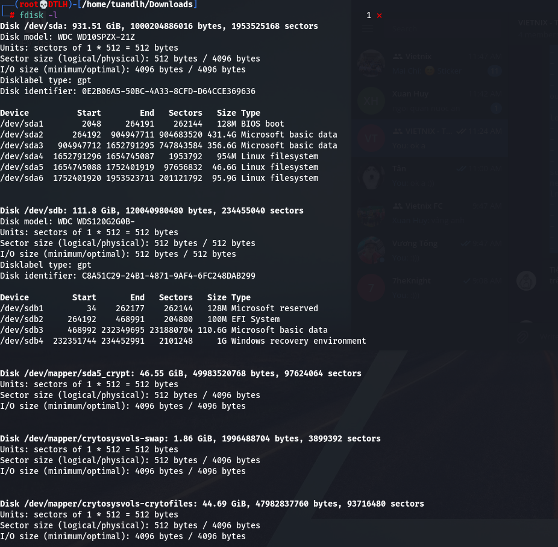
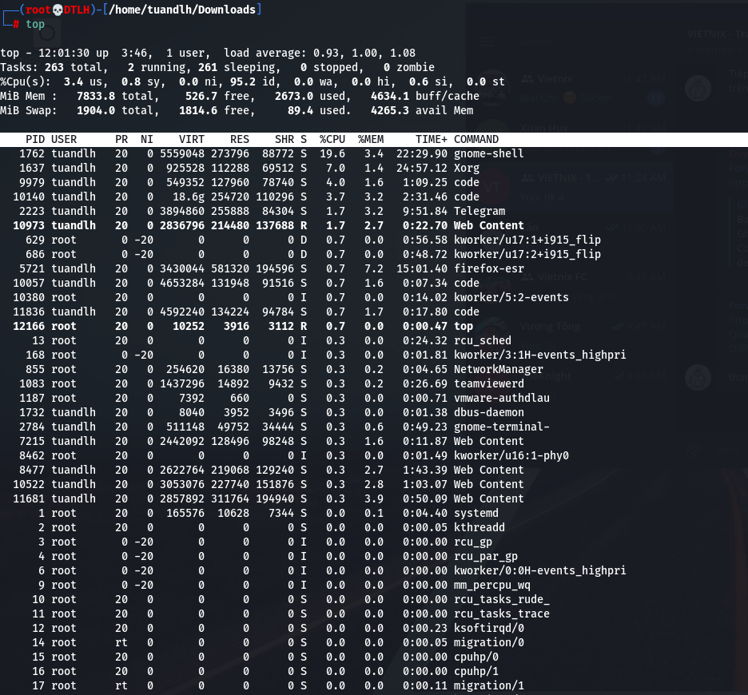
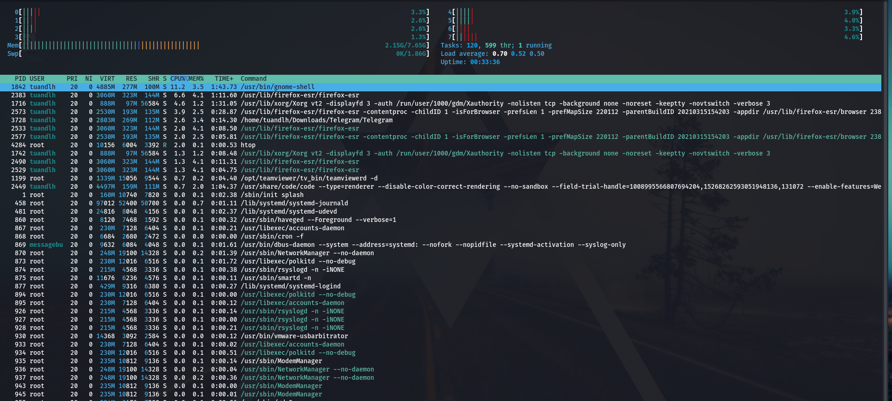
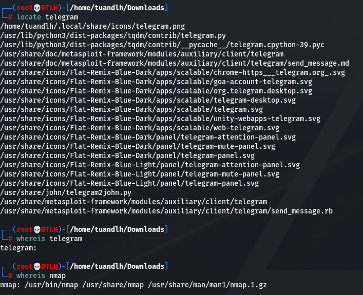
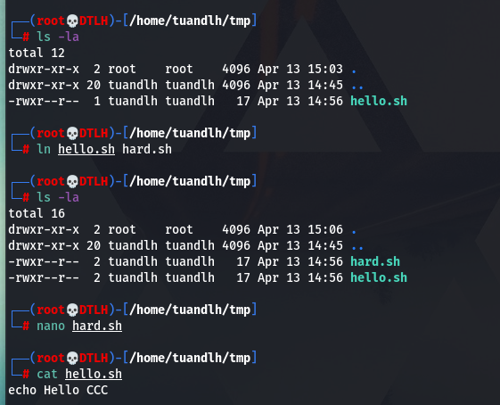
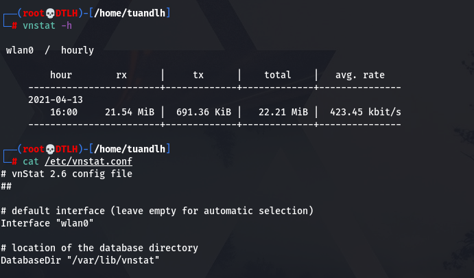
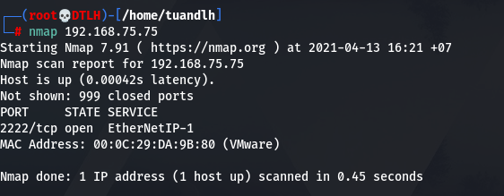
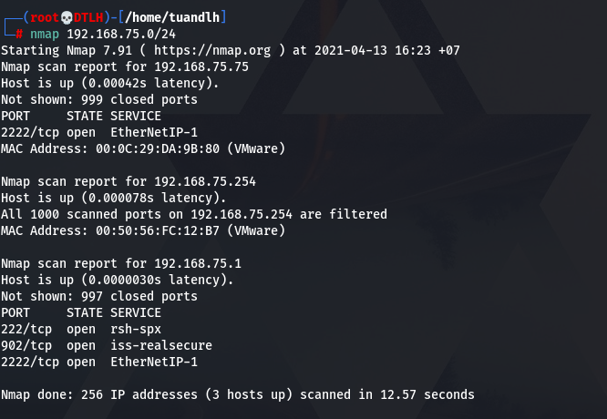
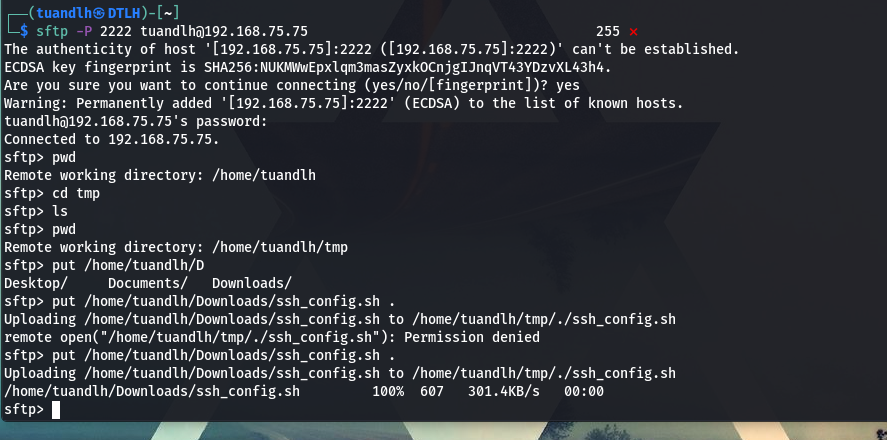

# Report_Vietnix_LinuxBasic

## BASE COMMAND:
#### `man <name_of_tool>` to see explain for tool and using Google Search to get more detail.


## 1. Check diskspaces
Code:
```
df -a
```
Result:


## 2. Check partitions
Code:
```
fdisk -l
```
Result:


## 3. Check cpu, ram, network
### 3.1 Check system realtime
Code:
```
top
```
Result:

Explain:

\- We can see system report at realtime monitoring with:
* `load average` as CPU GHz
*  `%Cpu(s) 3.4 us, 0.8 sy` as % CPU used for user and system
* `MidB Mem: ` as Memory used

### 3.2 Check network
Code:
```
netstat && netstat -s
```

Result 01:


Result 02:


# 4. Process Monitor
Code:
```
ps -aux
```
Result:


# OR

Code:
```
htop # as a full monitor tool.
```
Result:


Explain:
- We can use `htop` to see CPU stat, Mem stat and many process which is running in system. `htop` is a realtime tool.

# 5. List files/ directories
Code:
```
ls && ls -la
```
Result:

Explain: `ls` is command to show files/directories which have in dir, `ls -la` can also see `chmod` status of files/ folders inside.

# 6. Find, Copy, Move, Rename
## 6.1 Find
Code:
```
locate <str_to_find> # or using whereis for find src of tool
```
Result:



## 6.2 Copy, Move, Rename

Code:
```
cp <src file> <des file>
mv <src file> <des locate> # For move
mv <old name> <new name> # For rename
```
Result:


# 7. System Decentralization 

Code:
```
chmod a+x <file name>
chown <new user> <file to change owner>
chgrp <new gr> <file to change group owner>
```
Result:


Explain: 
* There are 3 types of rule with `r-read`, `w-write`, `x-excute` match with 4 types of urgent `u-user`, `g-group`, `o-other`, `a-all`.
* We can also using `chmod 777 hello.sh` for example to grant role with `1-excute`, `2-write`, `4-read`. The order of number is presented as `user_group_other`.

# 8. Editors

Code:
```
vi || gedit || nano
```
Explain:
* For `gedit`, we using as notepad
* For `nano`, when we editted, we can use `ctrl + s` to save and `ctrl + x` to exit
* For `vi`, press `i` to using insert mode. `ESC` to exit insert, `:wq` to save and exit, `:q!` to ignore change and exit.

# 9. Mount/ Unmount

Code:
```
mount <device name> <directory>
umount <dev name>

```
Result:


# Config: If we want the mount isn't umount after restart, we can edit `/etc/fstab` like below:


# 10. Symbolic Links

Code:
```
ln -s <target file> <sym link>
unlink <sym link> # or rm to remove link

```

Result:


Explain: Symbolic Links is a method which new link is linked to the older file. Both files have the same content. We can copy the sym file to any without interrupted the link. It likes a Shorcut in Windows. And when the origin file is removed, the sym link will be interrupted.


# 11. Hard Links

Code:
```
ln <target file> <hard link>
unlink <hard link> # or rm to remove link

```

Result:



Explain: This the the low-level links. the both files is linked to the same address space (which we call #inode). When one of the two is deleted. The other will not be effected!

# 12. Compressed/ Depressed

There are many compress method. In this part, I will demo with `tar.gz`.

Code:

```
tar -czvf <compressed file name> <list file to compressed>
tar -xzvf <compressed file> <dir to depressed>
```

Result 01: 


Result 02:


Explain: This type of compress is `tar.gz` compressed. So we can see the `z` tag in the `tar -czvf` and `tar -xzvf`. If we want to add password for compress, we can use `tar` with `openssl` or `gpg` tool to encrypt. The other way is using `zip` instead of `tar` as below:

Code:

```
zip -e <file_name>.zip <list_of_files>
unzip <file_name> <destination dir>
```

# 13. Network Traffic Tracking

In this part, I used `vnstat` as a main tool for monitor, but it needs time to get data from network card.

Code:

```
apt-get install vnstat
nano /etc/vnstat.conf   # Then we add network interface name for tracking
systemctl enable vnstat # This line will start vnstat when statup
systemctl start vnstat  # Start vnstat now

vnstat -d               # See daily data
vnstat -l               # Realtime tracking
```

Result sample:



Explain: `tx` and `rx` is `transmitted` and `received` data in network.

# 14. nmap, telnet, ping, ssh, tranfer from local to public host

## 14.1 nmap

**The simple way to scan port for host is:**
```
nmap <ip/ list_ips/ network layer to scan>
```

Result 01:



Result 02:



And we also use `nmap -v -T4 <ip(s)>` for faster scanning. `nmap` also has many other options for us to use.

## 14.2 telnet

Code:
```
telnet <ip> <port>
```

Explain: This is the old way to checking open port. The newly of this protocol is `SSH`.

Result 03:


## 14.3 ping

The easily way to test conection between two hosts is `ping` tool.

```
ping <ip>
```

Result 04:


Explain: using `-c 5` to define the number of packet transfer to target host.

## 14.4 ssh

The most common protocol for remote shell. We need `sshd` as server for `ssh-client` to connect.

```
ssh <user>@<ip> -p <port>
```

Note: In some case, we need to connect using certificate, and the command is: `ssh -i <link to key> <user>@<ip>`. Detail will be in the next part.

## 14.5 Transfer using SFTP

### Required: SSHD is running in target file!

Code:

```
sfpt -P <port> <user>@<ip>
```

Result: We using commands as ftp to get/ put from server



# 15. Generate ssh-key

We can 