# Report_Vietnix_LinuxBasic

## BASE COMMAND:
#### `man <name_of_tool>` to see explain for tool and using Google Search to get more detail.

# *~~ MENU FOR PART 01 ~~*

1. <a href='#1'>Check diskspaces</a>
1. <a href='#2'>Check partitions</a>
1. <a href='#3'>Check cpu, ram, network</a>
1. <a href='#4'>Process Monitor</a>
1. <a href='#5'>List files/ directories</a>
1. <a href='#6'>Find, Copy, Move, Rename</a>
1. <a href='#7'>System Decentralization</a>
1. <a href='#8'>Editors</a>
1. <a href='#9'>Mount/ Unmount</a>
1. <a href='#10'>Symbolic Links</a>
1. <a href='#11'>Hard Links</a>
1. <a href='#12'>Compressed/ Depressed</a>
1. <a href='#13'>Network Traffic Tracking</a>
1. <a href='#14'>nmap, telnet, ping, ssh, tranfer from local to public host</a>
1. <a href='#15'>Generate ssh-key</a>
1. <a href='#16'>Review file content</a>
1. <a href='#17'>Append at the end of file</a>
1. <a href='#18'>Basic tool review</a>
1. <a href='#19'>Understanding: Standard Input, Output, Error</a>
1. <a href='#20'>Redirecting stdout, stderr</a>
1. <a href='#21'>/dev/null - A place for nothing to be EXIST!</a>

<div id='1'></div>

## 1. Check diskspaces
Code:
```
df -a
```
Result:


<div id='2'></div>

## 2. Check partitions
Code:
```
fdisk -l
```
Result:


<div id='3'></div>

## 3. Check cpu, ram, network
### 3.1 Check system realtime
Code:
```
top
```
Result:

> Explain:

\- We can see system report at realtime monitoring with:
* `load average` as CPU GHz
*  `%Cpu(s) 3.4 us, 0.8 sy` as % CPU used for user and system
* `MidB Mem: ` as Memory used

### 3.2 Check network
Code:
```
netstat && netstat -s
```

Result 01:

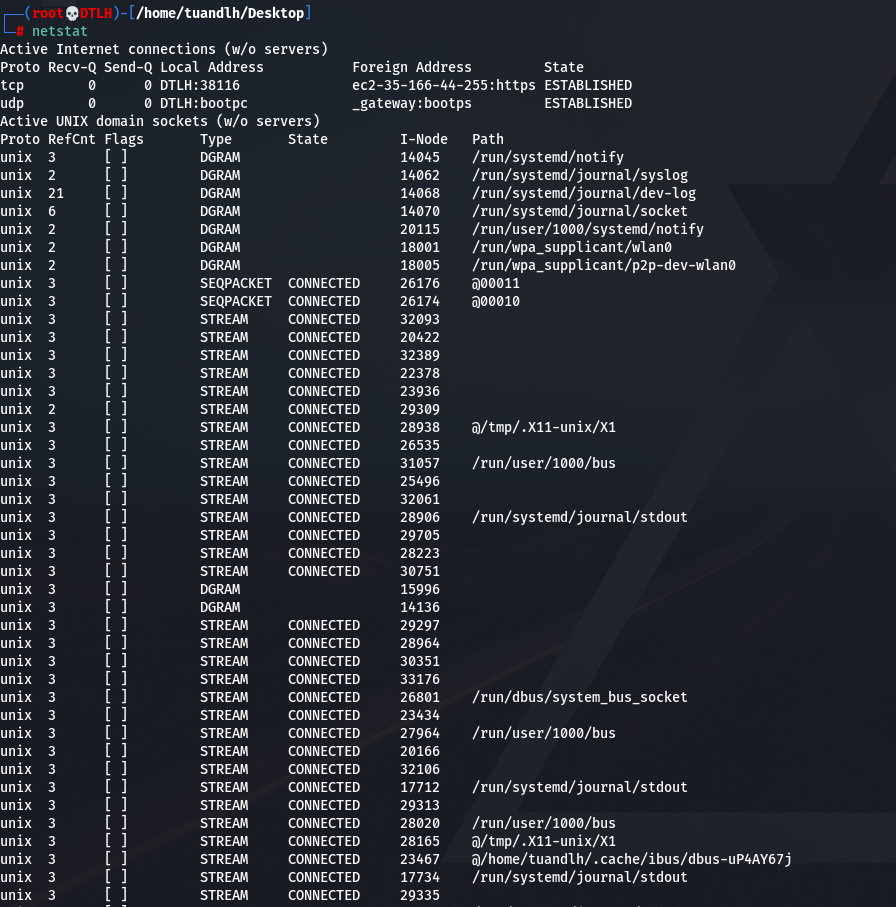

Result 02:

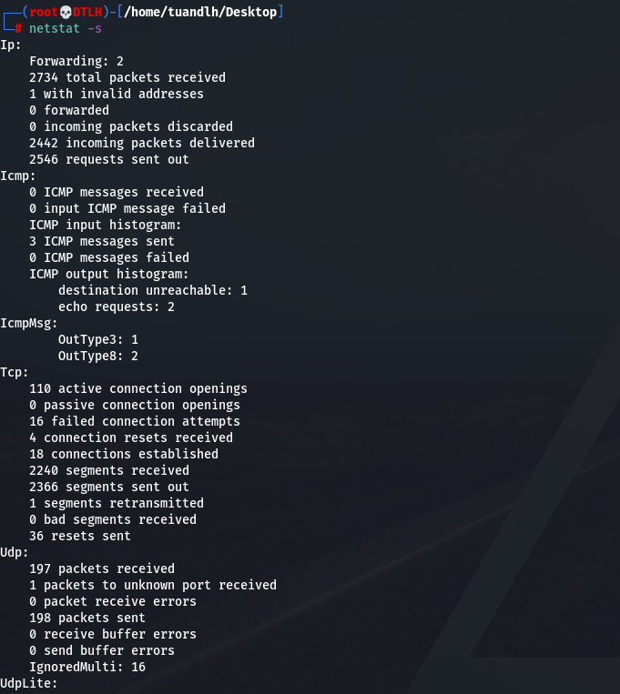

<div id='4'></div>

# 4. Process Monitor
Code:
```
ps -aux
```
Result:


# OR

Code:
```
htop # as a full monitor tool.
```
Result:


> Explain:
- We can use `htop` to see CPU stat, Mem stat and many process which is running in system. `htop` is a realtime tool.

<div id='5'></div>

# 5. List files/ directories
Code:
```
ls && ls -la
```
Result:


> Explain: `ls` is command to show files/directories which have in dir, `ls -la` can also see `chmod` status of files/ folders inside.

<div id='6'></div>

# 6. Find, Copy, Move, Rename
## 6.1 Find
Code:
```
locate <str_to_find> # or using whereis for find src of tool
```
Result:


## 6.2 Copy, Move, Rename

Code:
```
cp <src file> <des file>
mv <src file> <des locate> # For move
mv <old name> <new name> # For rename
```
Result:


<div id='7'></div>

# 7. System Decentralization 

Code:
```
chmod a+x <file name>
chown <new user> <file to change owner>
chgrp <new gr> <file to change group owner>
```
Result:

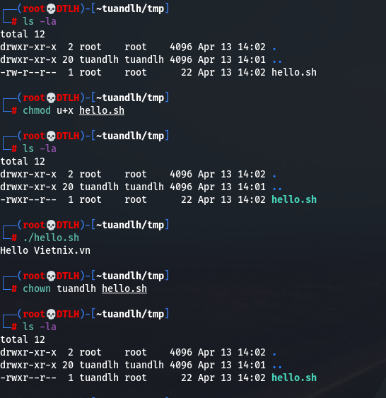

> Explain: 
* There are 3 types of rule with `r-read`, `w-write`, `x-excute` match with 4 types of urgent `u-user`, `g-group`, `o-other`, `a-all`.
* We can also using `chmod 777 hello.sh` for example to grant role with `1-excute`, `2-write`, `4-read`. The order of number is presented as `user_group_other`.

<div id='8'></div>

# 8. Editors

Code:
```
vi || gedit || nano
```
> Explain:
* For `gedit`, we using as notepad
* For `nano`, when we editted, we can use `ctrl + s` to save and `ctrl + x` to exit
* For `vi`, press `i` to using insert mode. `ESC` to exit insert, `:wq` to save and exit, `:q!` to ignore change and exit.

<div id='9'></div>

# 9. Mount/ Unmount

Code:
```
mount <device name> <directory>
umount <dev name>

```
Result:


# Config: If we want the mount isn't umount after restart, we can edit `/etc/fstab` like below:

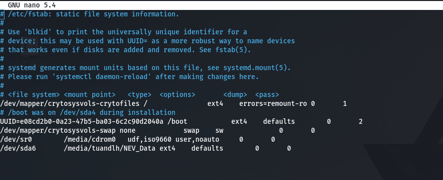

<div id='10'></div>

# 10. Symbolic Links

Code:
```
ln -s <target file> <sym link>
unlink <sym link> # or rm to remove link

```

Result:

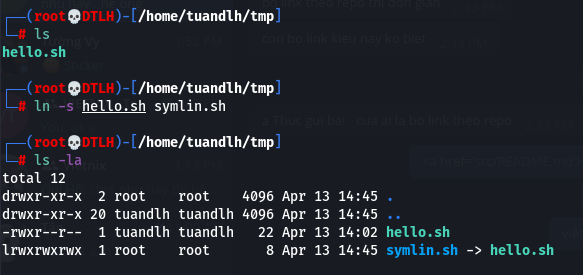

> Explain: Symbolic Links is a method which new link is linked to the older file. Both files have the same content. We can copy the sym file to any without interrupted the link. It likes a Shorcut in Windows. And when the origin file is removed, the sym link will be interrupted.

<div id='11'></div>

# 11. Hard Links

Code:
```
ln <target file> <hard link>
unlink <hard link> # or rm to remove link

```

Result:


> Explain: This the the low-level links. the both files is linked to the same address space (which we call #inode). When one of the two is deleted. The other will not be effected!

<div id='12'></div>

# 12. Compressed/ Depressed

There are many compress method. In this part, I will demo with `tar.gz`.

Code:

```
tar -czvf <compressed file name> <list file to compressed>
tar -xzvf <compressed file> <dir to depressed>
```

Result 01: 


Result 02:

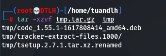

> Explain: This type of compress is `tar.gz` compressed. So we can see the `z` tag in the `tar -czvf` and `tar -xzvf`. If we want to add password for compress, we can use `tar` with `openssl` or `gpg` tool to encrypt. The other way is using `zip` instead of `tar` as below:

Code:

```
zip -e <file_name>.zip <list_of_files>
unzip <file_name> <destination dir>
```

<div id='13'></div>

# 13. Network Traffic Tracking

In this part, I used `vnstat` as a main tool for monitor, but it needs time to get data from network card.

Code:

```
apt-get install vnstat
nano /etc/vnstat.conf   # Then we add network interface name for tracking
systemctl enable vnstat # This line will start vnstat when statup
systemctl start vnstat  # Start vnstat now

vnstat -d               # See daily data
vnstat -l               # Realtime tracking
```

Result sample:


> Explain: `tx` and `rx` is `transmitted` and `received` data in network.

<div id='14'></div>

# 14. nmap, telnet, ping, ssh, tranfer from local to public host

## 14.1 nmap

**The simple way to scan port for host is:**
```
nmap <ip/ list_ips/ network layer to scan>
```

Result 01:


Result 02:


And we also use `nmap -v -T4 <ip(s)>` for faster scanning. `nmap` also has many other options for us to use.

## 14.2 telnet

Code:
```
telnet <ip> <port>
```

> Explain: This is the old way to checking open port. The newly of this protocol is `SSH`.

Result 03:


## 14.3 ping

The easily way to test conection between two hosts is `ping` tool.

```
ping <ip>
```

Result 04:


> Explain: using `-c 5` to define the number of packet transfer to target host.

## 14.4 ssh

The most common protocol for remote shell. We need `sshd` as server for `ssh-client` to connect.

```
ssh <user>@<ip> -p <port>
```

Note: In some case, we need to connect using certificate, and the command is: `ssh -i <link to key> <user>@<ip>`. Detail will be in the next part.

## 14.5 Transfer using SFTP

### Required: SSHD is running in target host!

Code:

```
sftp -P <port> <user>@<ip>
```

Result: We using commands as ftp to get/ put from server


<div id='15'></div>

# 15. Generate ssh-key

We can use `ssh-keygen` to create ssh key pairs for connection. But in some case, it requires some other tasks. So I writed a small tool to create ssh-keygen.

Result:

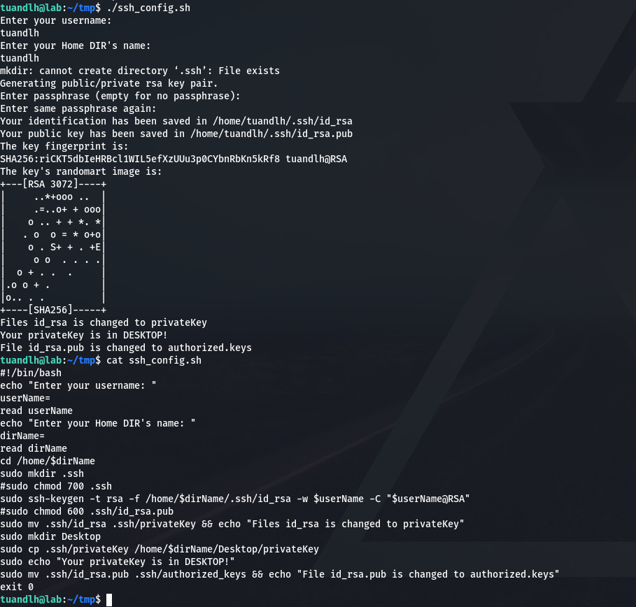

And then using `sftp` to get file from server and we can connect like below:

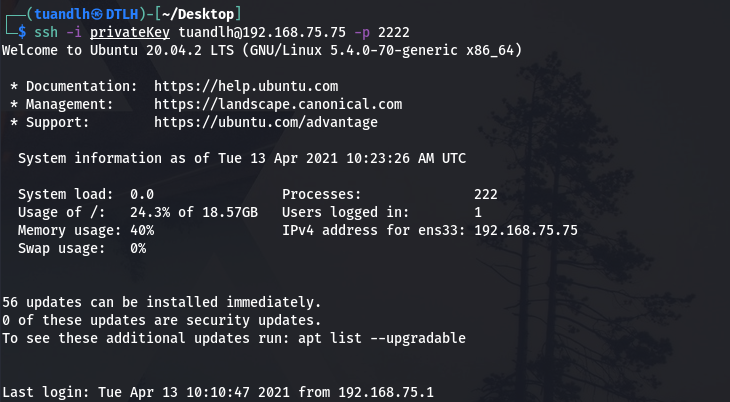

<div id='16'></div>

# 16. Review file content

Code:

```
cat <file_name> # OR
head <file_name> # OR\
tail <file_name>
```

Result: 


<div id='17'></div>

# 17. Append at the end of file

Code:
```
echo <content> >> <file name>
```

Result:

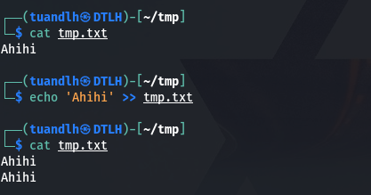

<div id='18'></div>

# 18. Basic tool review

## 18.1 find

```
find <dir to find> -iname '<maybe some words here>'
```


## 18.2 grep

This command ofthen uses to filter other command string result!

```
grep <content_to_filter>
```

## 18.3 awk

This command uses for:
* Scans a file line by line 
* Splits each input line into fields 
* Compares input line/fields to pattern 
* Performs action(s) on matched lines 

Code:

```
awk '/ahihi/ {print NR, $0}' <file name>
```

Result: 


> Explain: The example above will scan line by line and if the line have `ahihi`, awk print it. `NR` will show the line number.

## 18.3 sed

This is a stream editor for filtering and transforming text.
Code:

```
sed <option here> <script here> <file input> > <result file>
#Example
sed 's/ahihi/haha/' tmp.txt > changed.txt
```

Result: 

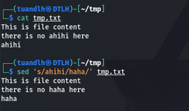

Note:
* By default, the sed command replaces the first occurrence of the pattern in each line and it won’t replace the second, third…occurrence in the line. To replace all, we need `sed 's/ahihi/haha/g' tmp.txt`
* result file **MUST** be the other name if we don't want to lost all.

## 18.4 tr

This tool using for translate or delete characters.
Code:

```
tr flags [SET1] [SET2]
# Example
cat tmp.txt | tr [:lower:] [:upper:]
```

Result: 


## 18.5 head, tail, less, more

These tools use to review data more professional.

## 18.6 sort

Typically, It just sort the file contents based on the lines!

Result: 


## 18.7 uniq - report or omit repeated lines

Result: 

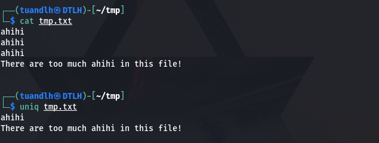

## 18.8 cut - remove sections from each line of filesq

Code:

```
cut <options here> <file>
# Example
echo "Ahihi do ngoc" | cut -d ' ' -f 2
```

Result:


## 18.9 join - join lines of two files on a common field

Code:

```
join <options> <file1> <file2>
```

Result: 

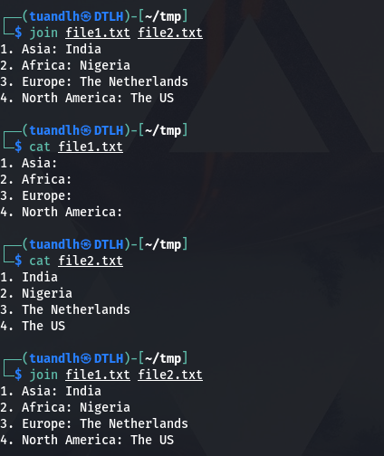

Note: We must set order numbers for joining file to make sure it joins correctly.

## 18.10 diff - compare files line by line

Result:

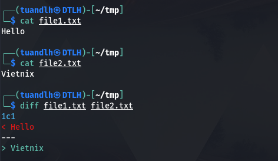

> Explain: the result show that, `1c1` we need to change the first line of file1 to get the same as file2.

## 18.11 xargs - build and execute command lines from standard input
xargs is a tool support execute command with may options.

Code:
```
xargs <options> <command>
```

Result:

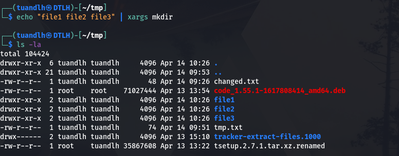

## 18.12 traceroute - print the route packets trace to network host

Code:
```
traceroute <ip> <package len>
```
Result:

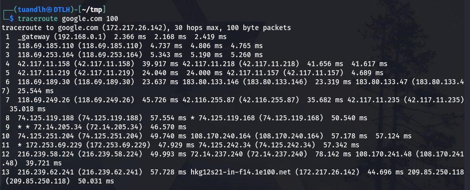

## 18.13 netstat - Print  network connections, routing tables, interface statistics, masquerade connections, and multicast memberships

Code:
```
netstat <options>
```

Example Result:


## 18.14 kill, pkill
While `kill` is a kill system call, `pkill` is also kill but can determine the PIDs for us, based on things like, process name, owner of the process, session id, etc.

Result: 


## 18.15 wc - print newline, word, and byte counts for each file

Result:

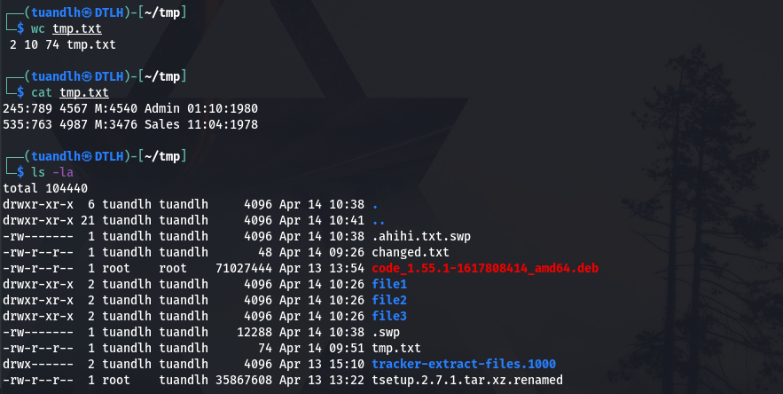

## 18.16 wget - it gets resource from web (as download)

## 18.17 git - the stupid content tracker

Code;

```
git config ...              # config for first use
git clone <url>             # for clone resource
git add ...                 # for add file/ folder to git repo
git commit -m "<command to commit>"
git push                    # push src to git
```

## 18.18 rsync - a fast, versatile, remote (and local) file-copying tool

Code:
```
rsync -r <src host dir> <des host dir>
```

Result:

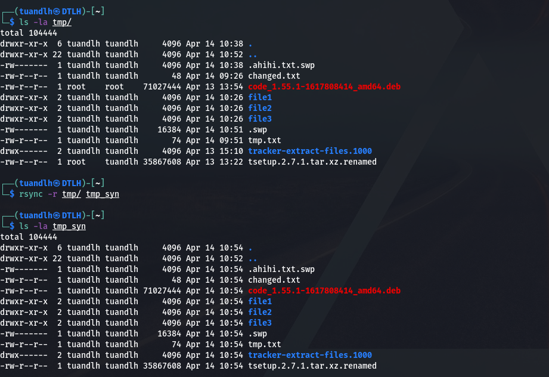

# OR We can rsync over network like below:

```
rsync -a -e "ssh -p 2222" tuandlh@192.168.75.75:tmp/ tmp
```

Result: 


## 18.19 tee - read and write file

Result:

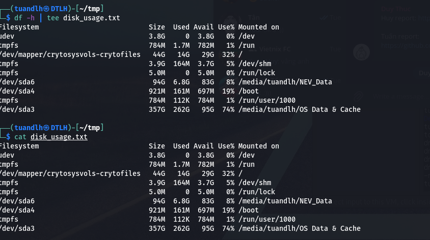

## 18.20 ln, mkdir - link file and make directory

<div id='19'></div>

# 19. Understanding: Standard Input, Output, Error

As I understamd: `Standard streams` is the method abstract connection channel between User and Computer (working over I/O Driver). Originally User input values via a physically connected system console (input via keyboard, mouse, ...) and Standard Streams abstract this Input as `Standard Input` then send it to system for executing, handing,... The output will as `Standard Output` and send it to Output device like monitor. If there is any error, a `standard Error` will return.

<div id='20'></div>

# 20. Redirecting stdout, stderr

* When `stdout` returning values, it will be send to other `stdin` stream for next execution.
* If `stderr` return any errors, it will be send to other `stdin` stream which maybe use for Developer, or User!

<div id='21'></div>

# 21. /dev/null - A place for nothing to be EXIST!

When User don't want to see any stupid thing from their Linux Computer, they just add `> /dev/null` at the end! LIKE BELOW:


# HAPPY ENDDING!

<a href='../README.md'>Click here for return!</a>