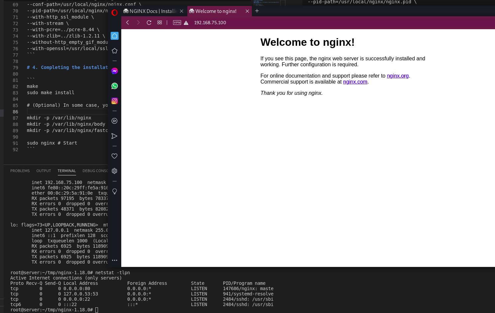

# Report_Vietnix_LinuxBasic

## BASE COMMAND:
#### `man <name_of_tool>` to see explain for tool and using Google Search to get more detail.

# *~~ MENU FOR PART 05 ~~*

1. <a href='#1'>Install NGINX Dependencies</a>
1. <a href='#2'>Download Resource</a>
1. <a href='#3'>Configuring the Build Options</a>
1. <a href='#4'>Completing the installation from Source</a>


# DEMO on UBUNTU SERVER 20.xx

<div id='1'></div>

# 1. Install NGINX Dependencies

- PCRE
```
apt-get install gcc, g++ # In case cannot run config file

wget https://ftp.pcre.org/pub/pcre/pcre-8.44.tar.gz
tar -zxf pcre-8.44.tar.gz
cd pcre-8.44
./configure --disable-dependency-tracking
make
sudo make install
```

- zlib
```
wget http://zlib.net/zlib-1.2.11.tar.gz
tar -zxf zlib-1.2.11.tar.gz
cd zlib-1.2.11
./configure
make
sudo make install
```

- OpenSSL
```
wget http://www.openssl.org/source/openssl-1.1.1g.tar.gz
tar -zxf openssl-1.1.1g.tar.gz
cd openssl-1.1.1g
./config --prefix=/usr/local/ssl --openssldir=/usr/local/ssl shared zlib
make && make test
sudo make install

nano /etc/environment

# Edit like below:
PATH="/usr/local/sbin:/usr/local/bin:/usr/sbin:/usr/bin:/sbin:/bin:/usr/games:/usr/local/games:/usr/local/ssl/bin"

source /etc/environment
echo $PATH
```

<div id='2'></div>

# 2. Download Resource

```
wget https://nginx.org/download/nginx-1.18.0.tar.gz
tar zxf nginx-1.18.0.tar.gz
cd nginx-1.18.0
```

<div id='3'></div>

# 3. Configureing the Build Options

```
$ ./configure \
--sbin-path=/usr/local/nginx/nginx \
--conf-path=/usr/local/nginx/nginx.conf \
--pid-path=/usr/local/nginx/nginx.pid \
--with-http_ssl_module \                # If you do not using SSL, please remove this option
--with-stream \
--with-pcre=../pcre-8.44 \
--with-zlib=../zlib-1.2.11 \
--without-http_empty_gif_module \
--with-openssl=/usr/local/ssl/bin
```

<div id='4'></div>

# 4. Completing the installation from Source

```
make
sudo make install

# (Optional) In some case, you need to add some dir like below:

mkdir -p /var/lib/nginx
mkdir -p /var/lib/nginx/body
mkdir -p /var/lib/nginx/fastcgi

sudo nginx # Start
```

Result:



# HAPPY ENDDING!

<a href='../README.md'>Coming back!</a>