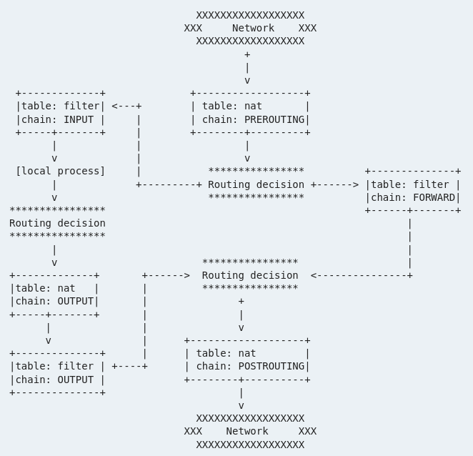

# Report_Vietnix_LinuxBasic

# *~~ MENU FOR PART 08 IPTABLES && NETWORK FLOW ~~*

# 1. Iptables packet flow diagram

### What is iptables?

Iptables is used to inspect, modify, forward, redirect, and/or drop IP packets. The code for filtering IP packets is already built into the kernel and is organized into a collection of tables, each with a specific purpose. The tables are made up of a set of predefined chains, and the chains contain rules which are traversed in order.

### Flow Diagram:

> Explain:

* Tables: iptables has five tables
    * `raw` is used only for configuring packets so that they are exempt from connection tracking.
    * `filter` is the default table, and is where all the actions typically associated with a firewall take place.
    * `nat` is used for network address translation (e.g. port forwarding).
    * `mangle` is used for specialized packet alterations.
    * `security` is used for Mandatory Access Control networking rules

* `Tables` consist of `chains`, which are lists of `rules` which are followed in order. The default table, `filter`, contains three built-in chains: `INPUT`, `OUTPUT` and `FORWARD` which are activated at different points of the packet filtering process, as illustrated in the flow chart. The `nat` table includes `PREROUTING`, `POSTROUTING`, and `OUTPUT` chains. 